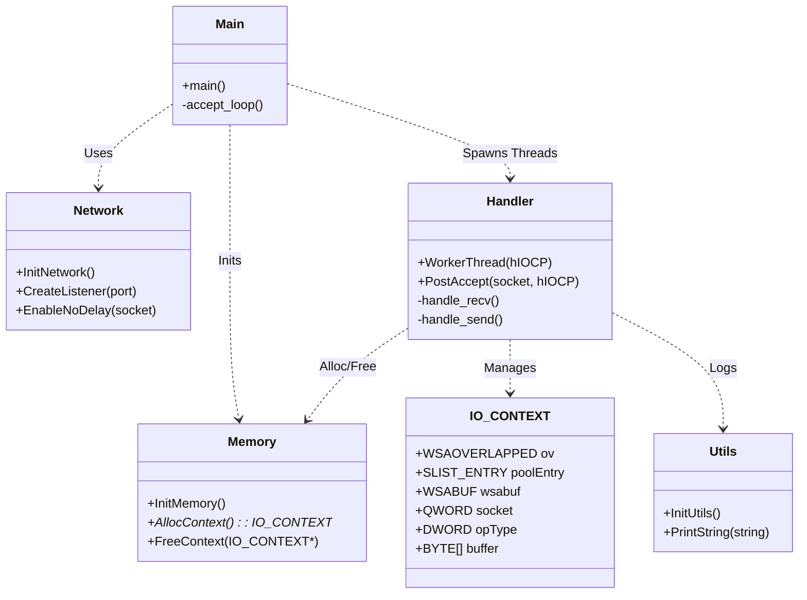

# Win64-echod

A high-performance, I/O Completion Port (IOCP) based TCP Echo Server written entirely in **x64 Assembly (MASM)** for Windows.

This project serves as a reference for low-level systems programming, demonstrating manual memory management, lock-free synchronization, Win32 API integration, and enterprise-grade concurrency models without the safety net of a high-level language.

## 🚀 Features

### 1. High-Performance Architecture (IOCP)
Uses the Windows **I/O Completion Ports (IOCP)** model, the standard for scalable Windows networking (powering IIS, SQL Server).
- **Scalability:** A fixed thread pool (2x CPU cores) efficiently handles thousands of concurrent connections.
- **Zero-Blocking:** Threads sleep until I/O completes, eliminating CPU waste.
- **Proactor Pattern:** Fully asynchronous `WSARecv` and `WSASend` operations.

### 2. Advanced Memory Management
- **Lock-Free Object Pooling:** Implements a custom lookaside list using Windows **Interlocked SList** API (`InterlockedPushEntrySList`, `InterlockedPopEntrySList`) to recycle `IO_CONTEXT` structures rapidly without mutex contention.
- **Process Heap Fallback:** Seamlessly allocates from the OS heap when the pool is empty.
- **Zero-Copy Intent:** I/O buffers are embedded directly in the context structure to minimize pointer indirection.

### 3. Network Optimization
- **TCP_NODELAY:** Nagle's algorithm is explicitly disabled to minimize latency for small packets.
- **Overlapped I/O:** Manages `WSAOVERLAPPED` state explicitly.
- **WinSock 2:** Direct integration with `Ws2_32.lib` for raw socket control.

### 4. Low-Level Win64 ABI Compliance
Demonstrates rigorous adherence to the x64 calling convention:
- **Shadow Space:** Manual management of the 32-byte "home space" for every API call.
- **Stack Alignment:** 16-byte stack alignment guaranteed before calls.
- **Register Safety:** Preservation of non-volatile registers (`RBX`, `RSI`, `RDI`, `R12-R15`).

## 🛠 Technical Implementation

### The Architecture
1.  **Initialization:** `WSAStartup` + `CreateIoCompletionPort`.
2.  **Thread Pool:** Detects hardware cores (`GetSystemInfo`) and spawns worker threads.
3.  **Accept Loop (Main Thread):** Accepts connections and immediately associates them with the IOCP handle.
4.  **Async Cycle (Worker Threads):**
    - Threads wait on `GetQueuedCompletionStatus`.
    - Upon waking, they process the completed I/O (Recv/Send).
    - If data was received, a Send is posted. If sent, a Recv is posted.
    - Contexts are recycled via the SList pool upon disconnection.



### Build System (CMake)
The project uses **CMake** (3.10+) to orchestrate the build, handling the discovery of the Microsoft Macro Assembler (`ml64.exe`) and configuring the linker for:
- **Debug:** Full symbols (`/Zi`, `/DEBUG`).
- **Release:** aggressive linker optimizations (`/OPT:REF`, `/OPT:ICF`) to strip unused code.

## 🧪 Testing

Includes a Python-based test suite to verify correctness and stability.

- **`test_echo.py`**: Functional test verifying data integrity.
- **`test_concurrency.py`**: Stress test spawning multiple threads to hammer the server and detect race conditions.

## 🏗 Building and Running

### Prerequisites
- Visual Studio Build Tools (C++ / MASM x64 support)
- CMake 3.10+
- Python 3.x (for tests)

### 1. Build
Use the helper script:
```cmd
.\build.bat
```
*Alternatively, standard CMake commands work:*
```cmd
mkdir build
cd build
cmake -G "Ninja" ..
cmake --build .
```

### 2. Run Server
```cmd
.\run_server.bat
```
*Server listens on port 8080 by default.*

### 3. Run Tests
Open a new terminal while the server is running:
```cmd
.\run_tests.bat
```

---

## 📜 License

MIT License - see [LICENSE](LICENSE) for details.