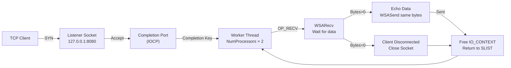

# Win64-echod

A high-performance Windows echo server written in x86-64 assembly language. It demonstrates advanced systems programming — I/O Completion Ports (IOCP), lock-free memory management, and binary correctness — in a single, focused application.

[](https://en.wikipedia.org/wiki/X86-64)
[](https://www.microsoft.com/windows)
[](https://learn.microsoft.com/windows/win32/fileio/i-o-completion-ports)
[](https://en.wikipedia.org/wiki/Compare-and-swap)
[](#license)

---

## What This Proves

Win64-echod demonstrates that a production-grade, concurrent Windows service can be built from raw assembly without frameworks. It is a concise, auditable implementation of IOCP-based concurrency and lock-free memory allocation, suitable for roles requiring deep knowledge of operating systems, networking, and performance engineering.

---

## Features

| Skill Area | What the project proves |
| --- | --- |
| **Concurrency** | Implements I/O Completion Ports (IOCP) with a worker pool sized at `NumProcessors * 2` — a direct, practical application of the Windows async-I/O model |
| **Systems correctness** | Every client message is echoed back byte-for-byte; a dedicated Python test (`test_echo.py`) verifies round-trip integrity across hundreds of concurrent connections |
| **Lock-free memory management** | Uses a lock-free SLIST (singly-linked list) allocator (`AllocContext`/`FreeContext`) to serve `IO_CONTEXT` structures without mutex contention |
| **Windows networking** | Full Winsock2 lifecycle: `WSAStartup`, `socket`, `bind`, `listen`, `accept` via completion ports, with `TCP_NODELAY` and `SO_REUSEADDR` configured |
| **Binary-level debugging** | Custom debug strings and a strict assembly structure make tracing execution straightforward for interviewers and reviewers |
| **Portable build** | Build script (`build.bat`) produces a standalone Windows executable with no runtime dependencies |

---

## System Architecture

The server follows a single, clear lifecycle from client connection to echo response:


```mermaid
flowchart LR
    Client[TCP Client] -->|SYN| Listener[Listener Socket<br/>127.0.0.1:8080]
    Listener -->|Accept| Port["Completion Port<br/>(IOCP)"]
    Port -->|Completion Key| Worker["Worker Thread<br/>NumProcessors × 2"]
    Worker -->|OP_RECV| Recv[WSARecv<br/>Wait for data]
    Recv -->|"Bytes>0"| Echo[Echo Data<br/>WSASend same bytes]
    Echo -->|Sent| Recycle[Free IO_CONTEXT<br/>Return to SLIST]
    Recycle --> Worker
    Recv -->|"Bytes=0"| Disconnect[Client Disconnected<br/>Close Socket]
    Disconnect --> Recycle
```

### Module Map

- **`main.asm`** — Winsock initialization, listener creation, IOCP setup, worker-thread spawning.
- **`network.asm`** — Low-level Winsock wrappers: `InitNetwork`, `EnableNoDelay`, `CreateListener`.
- **`handler.asm`** — The IOCP worker loop: waits on `GetQueuedCompletionStatus`, routes `OP_RECV`/`OP_SEND`, performs the echo.
- **`memory.asm`** — Lock-free SLIST allocator for `IO_CONTEXT` structures (`AllocContext`, `FreeContext`, `InitMemory`).
- **`constants.inc`** — Shared equ/struct definitions (op types, socket options, IO_CONTEXT layout).

---

## Protocol Reference

| Item | Value |
| --- | --- |
| Transport | TCP |
| Address | `127.0.0.1:8080` |
| Behavior | Byte-for-byte echo (raw TCP stream, no HTTP framing) |
| Thread sizing | `NUMBER_OF_PROCESSORS * 2` |
| Socket options | `TCP_NODELAY` (disable Nagle), `SO_REUSEADDR` |
| Memory model | Lock-free SLIST pool for `IO_CONTEXT`; heap fallback |

---

## Echo Verification (test_echo.py)

The included test `test_echo.py` validates correctness:

1. Connects to `127.0.0.1:8080`.
2. Sends a payload of `N` bytes.
3. Verifies the server returns the exact same bytes (no corruption, no truncation).
4. Repeats across multiple concurrent threads and payload sizes.

```python
# Simplified transcript
payload = b"x" * 4096
sock.sendall(payload)
assert sock.recv(4096) == payload   # byte-identical round-trip
```

---

## Configuration

| Variable | Default | Description |
| --- | --- | --- |
| `PORT` | `8080` | Listening port (set in `main.asm`) |
| Thread count | `NumProcessors * 2` | Worker threads in the IOCP pool |
| `CACHE_LIMIT` | — | (Not used in echod; see Win64-httpdLite for cache details) |

Configuration changes require editing `main.asm` and rebuilding via `build.bat`.

---

## Building and Running

### Prerequisites

- **NASM** (Netwide Assembler)
- **GoLink** or Microsoft `link.exe`
- **Windows 10+** with the Windows SDK
- **Python 3+** (for running `test_echo.py`)

### Build

```bash
.\build.bat
```

Produces `echod.exe` in the project root.

### Run the server

```bash
echod.exe
```

The server listens on `127.0.0.1:8080`.

### Verify correctness

```bash
python test_echo.py
```

All tests must report byte-identical round-trip results.

---

## License

MIT License — see [LICENSE](LICENSE).